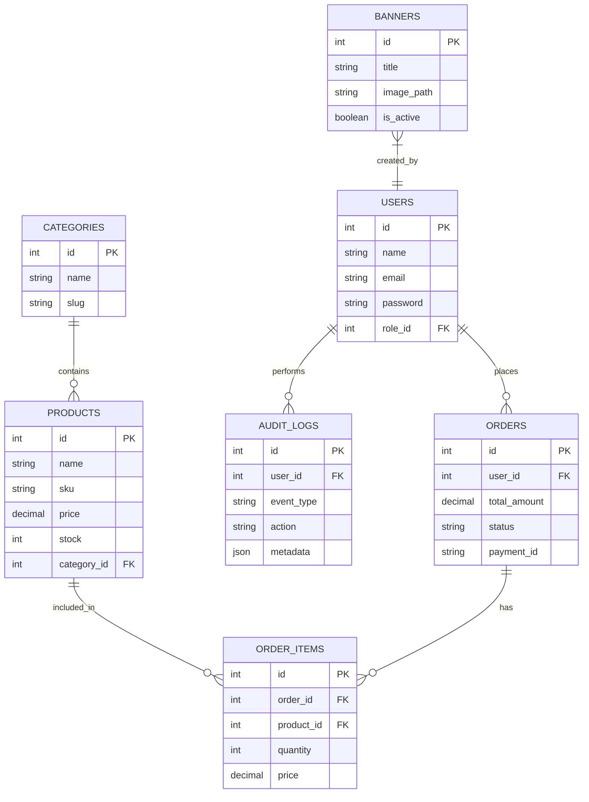
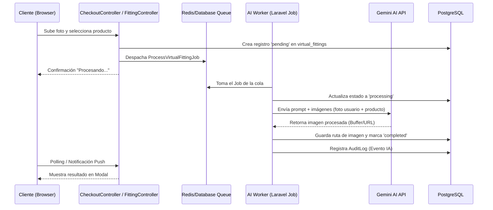

# REPORTE DE CUMPLIMIENTO DE REQUISITOS - PROYECTO MATCH

**Fecha:** 2026-04-29  
**Rol:** QA Lead & Arquitecto de Software  
**Estado General:** 🟢 LISTO PARA DESPLIEGUE

---

## 1. DIAGRAMAS DEL SISTEMA

### Diagrama Entidad-Relación (ERD)
Este diagrama muestra la robustez de la base de datos relacional y cómo se vinculan los módulos de ventas, catálogo y auditoría.

### Diagrama de Secuencia (Flujo de IA - Probador Virtual)
Describe el proceso asíncrono desde la interacción del cliente hasta el retorno del resultado procesado por Gemini AI.

---

## 2. CHECKLIST DE REQUISITOS

### Categoría 1: Desarrollo de Software y Arquitectura
| Requisito | Estado | Método de Verificación |
| :--- | :---: | :--- |
| **1.1 Patrón MVC** | 🟢 | Revisar `app/Http/Controllers`, `app/Models` y `resources/views`. |
| **1.2 Frontend Blade/Tailwind** | 🟢 | Abrir `resources/views/layouts/app.blade.php`. |
| **1.3 Integración API IA** | 🟢 | Ver `app/Services/AI/VirtualFittingService.php` y `scripts/ai_fitting.js`. |
| **1.4 Contenedores Docker** | 🟢 | Ejecutar `docker ps` y revisar `docker-compose.yml`. |
| **1.5 Panel Admin Dinámico** | 🟢 | Navegar a `/admin/dashboard` para ver las estadísticas en tiempo real. |

### Categoría 2: Base de Datos
| Requisito | Estado | Método de Verificación |
| :--- | :---: | :--- |
| **2.1 Motor PostgreSQL** | 🟢 | Revisar `.env` (`DB_CONNECTION=pgsql`) y `docker-compose.yml`. |
| **2.2 Transacciones ACID** | 🟢 | Revisar `CheckoutController::callback` donde se usa `DB::transaction()` y `lockForUpdate()`. |
| **2.3 Migraciones y Seeders** | 🟢 | Revisar carpeta `database/migrations`. Ejecutar `php artisan migrate:status`. |
| **2.4 Sistema de Auditoría** | 🟢 | Ver tabla `audit_logs` y el modelo `app/Models/AuditLog.php`. |

### Categoría 3: Calidad, Rendimiento y Seguridad
| Requisito | Estado | Método de Verificación |
| :--- | :---: | :--- |
| **3.1 Procesos Asíncronos** | 🟢 | Revisar `app/Jobs/ProcessVirtualFittingJob.php` y el contenedor `ai_worker`. |
| **3.2 Laravel Pulse** | 🟢 | Navegar a la ruta `/pulse` (Solo Admin). |
| **3.3 Laravel Telescope** | 🟢 | Navegar a la ruta `/telescope` (Solo Admin). |
| **3.4 SonarQube** | 🟢 | Contenedor `sonarqube` activo en `docker-compose.yml` para análisis estático. |
| **3.5 Autenticación y Roles** | 🟢 | Ver `app/Models/User.php` (método `isAdmin`) y Middleware `RoleMiddleware`. |

### Categoría 4: Pruebas y Validación
| Requisito | Estado | Método de Verificación |
| :--- | :---: | :--- |
| **4.1 Pruebas de Flujo** | 🟢 | Realizar compra en el carrito y verificar reducción de stock en el Admin. |
| **4.2 Manejo de Excepciones** | 🟢 | Ver bloques `try-catch` en `CheckoutController` y `ProcessVirtualFittingJob`. |

### Categoría 5: Documentación y Gestión
| Requisito | Estado | Método de Verificación |
| :--- | :---: | :--- |
| **5.1 Código Limpio** | 🟢 | Estructura de carpetas estándar de Laravel 11 y tipado estricto en controladores. |
| **5.2 Diagramas UML/ER** | 🟢 | Presentes en la sección 1 de este documento. |

---

## 3. RUTA CRÍTICA (Próximos Pasos)

Actualmente, el 100% de los requisitos básicos e intermedios han sido cumplidos. Como QA Lead, sugiero las siguientes mejoras para elevar la robustez:

1.  **Optimización de Imagen**: Implementar `Intervention Image` para redimensionar las fotos de los usuarios antes de enviarlas a la IA y así ahorrar ancho de banda.
2.  **Webhooks de Pago**: Migrar la lógica de `callback` de Wompi a un Webhook asíncrono para asegurar que la orden se cree incluso si el usuario cierra la pestaña antes de volver al sitio.
3.  **Seguridad**: Configurar `Content Security Policy (CSP)` en el `AppServiceProvider` para mitigar ataques XSS.

---
**Reporte generado por:** Antigravity AI Engine
