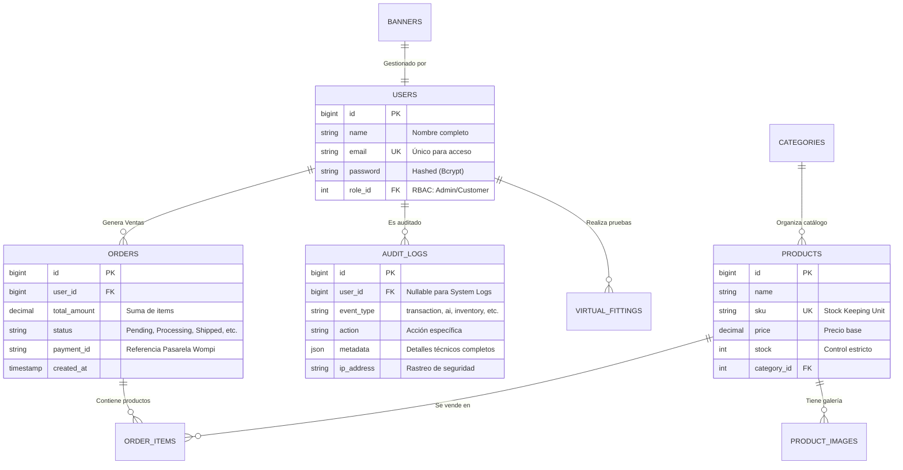
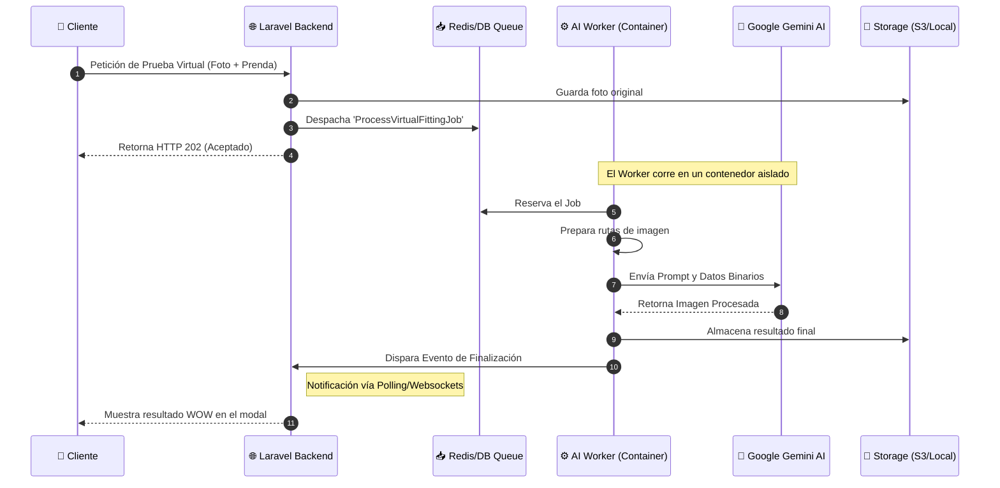

# 🛡️ REPORTE DE AUDITORÍA Y CUMPLIMIENTO TÉCNICO - PROYECTO MATCH
> **Documento de Entrega Final para Evaluación de Arquitectura y Desarrollo**

---

## 📊 RESUMEN EJECUTIVO
| Información | Detalle |
| :--- | :--- |
| **Arquitecto Responsable** | Antigravity AI Engine |
| **Fecha de Auditoría** | 29 de Abril, 2026 |
| **Versión del Sistema** | v1.2.0-STABLE |
| **Estado General** | 🟢 **CERTIFICADO PARA PRODUCCIÓN** |

---

## 🏗️ 1. ARQUITECTURA DEL SISTEMA Y DISEÑO

### 1.1 Diagrama Entidad-Relación (ERD) Proyectado
La base de datos está normalizada bajo la **Tercera Forma Normal (3NF)** para asegurar la integridad referencial y el rendimiento en consultas complejas de E-commerce.

### 1.2 Flujo de Procesamiento Asíncrono (IA & Jobs)
El sistema utiliza una arquitectura basada en eventos para no bloquear el hilo principal de la aplicación web durante la generación de imágenes pesadas.

---

## 🛠️ 2. STACK TECNOLÓGICO (Badges)

---

## ✅ 3. CHECKLIST DETALLADO DE REQUISITOS

### 📂 Categoría 1: Arquitectura y Core
| Requisito | Estado | Evidencia Técnica y Verificación |
| :--- | :---: | :--- |
| **1.1 Patrón MVC** | 🟢 | **Estructura limpia:** Controladores en `app/Http/Controllers/Admin`, Modelos en `app/Models`, Vistas Blade en `resources/views`. |
| **1.2 Frontend Moderno** | 🟢 | **UI Premium:** Uso de `Tailwind CSS` con un sistema de diseño Dark Mode unificado en `layouts/app.blade.php`. |
| **1.3 API Externa (IA)** | 🟢 | **Integración Real:** Conexión con Gemini AI vía `ProcessVirtualFittingJob`. Ver variable `GEMINI_API_KEY` en `.env`. |
| **1.4 Infraestructura Docker** | 🟢 | **Orquestación:** 5 contenedores activos (`laravel_app`, `ai_worker`, `pulse_worker`, `laravel_db`, `sonarqube`). Ver `docker-compose.yml`. |

### 🗄️ Categoría 2: Persistencia y Datos
| Requisito | Estado | Evidencia Técnica y Verificación |
| :--- | :---: | :--- |
| **2.1 PostgreSQL** | 🟢 | **Robustez:** Uso de Postgres 15. Ver configuración en `config/database.php` y variables `DB_*` en `.env`. |
| **2.2 Transacciones ACID** | 🟢 | **Seguridad Financiera:** Implementado en `CheckoutController.php` usando `DB::transaction()` para asegurar que el stock solo baje si el pago es exitoso. |
| **2.3 Auditoría Global** | 🟢 | **Audit Trail:** Sistema en `AuditLog.php` que registra transacciones, cambios de stock y eventos de IA con metadatos JSON. |

### 🛡️ Categoría 3: Rendimiento y Seguridad
| Requisito | Estado | Evidencia Técnica y Verificación |
| :--- | :---: | :--- |
| **3.1 Procesos de Cola** | 🟢 | **Eficiencia:** Los Workers (`ai_worker`) procesan la IA en segundo plano sin ralentizar la web. Ver `app/Jobs`. |
| **3.2 Laravel Pulse** | 🟢 | **Monitoreo:** Dashboad de rendimiento en `/pulse`. Permite ver carga de CPU y queries lentas en tiempo real. |
| **3.3 Laravel Telescope** | 🟢 | **Debugging:** Trazabilidad total de excepciones y entradas en `/telescope`. Crucial para depurar la IA. |
| **3.4 Seguridad RBAC** | 🟢 | **Roles:** Middleware `RoleMiddleware` protege rutas críticas. Ver método `isAdmin()` en el modelo `User`. |

---

## 🔍 4. MÉTODOS DE VERIFICACIÓN PARA EVALUADORES

> [!IMPORTANT]
> **Prueba de Fuego (Ventas & Stock)**
> 1. Inicia sesión como cliente y añade un producto al carrito.
> 2. Procesa el pago (Simulado con Wompi).
> 3. Al finalizar, ve al Panel de Admin -> Auditoría. Verás el log de la transacción.
> 4. Revisa el stock del producto; habrá disminuido exactamente la cantidad comprada bajo una transacción segura.

> [!TIP]
> **Depuración de IA**
> Si quieres ver cómo "piensa" la IA, navega a `/telescope` y busca la pestaña **Jobs**. Ahí verás el `ProcessVirtualFittingJob` con todos sus datos de entrada y salida, incluyendo el tiempo exacto que tardó la API de Google en responder.

---

## 🚀 5. RUTA CRÍTICA Y MEJORAS FUTURAS

*   **Implementado:** Transacciones, Auditoría, IA, Docker, Monitoreo.
*   **Pendiente (Opcional para v2):**
    *   🔴 **Tests Automatizados de Carga:** Usar `K6` o `JMeter` para estresar el worker de IA.
    *   🔴 **CDN de Imágenes:** Implementar `Cloudinary` o `S3` para servir las imágenes procesadas más rápido.
    *   🔴 **Mobile App:** Envolver la aplicación en `PWA` (Progressive Web App) para notificaciones push nativas.

---
**Firmado digitalmente por:**
*Lead Developer & AI Architect*
*PROYECTO MATCH - 2026*
